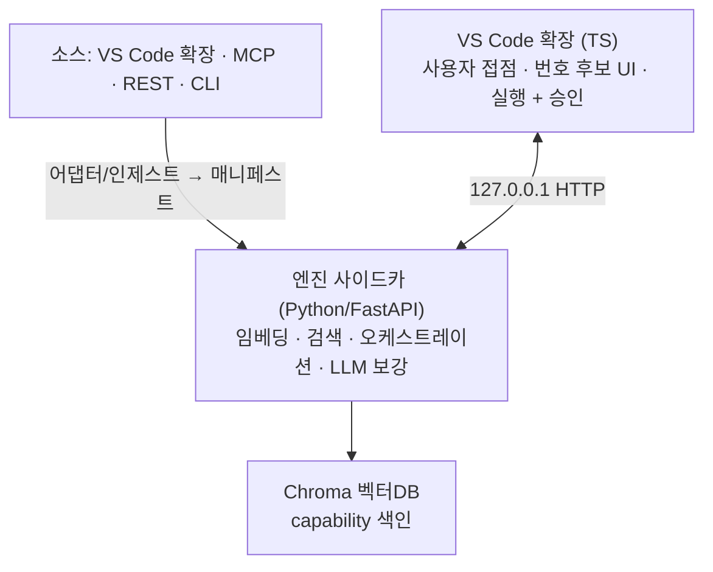

# PAESTRO

**의미로 고르는 플러그인 라우터 + 오케스트레이터.** VS Code 확장으로 동작한다.

개발자가 자연어로 시키면, PAESTRO가 벡터DB에서 관련 도구(VS Code 확장 명령 · MCP · REST · CLI)를 찾아 **번호가 붙은 후보 목록**으로 띄운다. 사용자가 고르면 실행하고, 위험한 작업(`irreversible`)은 실행 직전 승인을 받는다.

```
"이 파일 lint 정리하고 싶어"
  1. ESLint: Fix all auto-fixable Problems   (reversible)
  2. Format Document                          (read_only)
  3. Prettier: Format                         (reversible)
  5. 직접 지정 / 설정…
> _
```

---

## 왜 필요한가

도구가 많아질수록 LLM은 오히려 못 고른다 — 50~100개만 넘어도 성능이 급락하고, 에이전트당 도구 상한은 128개다. 전부 프롬프트에 넣는 방식(prompt bloat)은 한계에 부딪혔다.

**해법:** 도구를 프롬프트에 다 넣지 말고 **벡터DB에 색인해두고 필요한 것만 의미 검색으로 꺼낸다.** (근거: RAG-MCP — 프롬프트 토큰 50%↓, 도구 선택 정확도 3배↑.) PAESTRO는 이 검색을 개발자가 이미 쓰는 **VS Code 안에서** 제공한다.

## 지금 상태

- 🟢 **오픈소스 크롤 레지스트리 1,624 capability · 25 소스 · 4 런타임** — VS Code 확장 · MCP 서버(공식 레지스트리) · REST API(apis.guru: Stripe·Slack·GitHub 등) · CLI(git·docker·gh·kubectl)를 실제 크롤(`registry/crawl.py`). 승인 대상(irreversible) 106개 자동 분류.
- 🟢 **END-TO-END 검증**: 크롤 → 정규화 → 엔진(mpnet+Chroma) 색인 → 의미 검색. 실측 top-3 전체 64%·KO 57%·EN 71%.
- 🟢 **walking skeleton** end-to-end: 자연어 → 검색 → 번호선택 → 실행 + 승인 게이트
- 🟢 **안전 게이트 실재화**: 파괴적 명령(삭제·배포·force)은 `irreversible`로 분류되어 승인 필요
- 🟢 **다국어 검색**: 한국어 동의어 주입 + 다국어 임베딩. 실측(996개, top-3): lexical **KO 57%**·EN 86%, dense EN 86%. (엔진은 더 강한 mpnet-base-v2로 hybrid)

## 레지스트리 (오픈소스 크롤)

```bash
python pae.py crawl              # 오픈소스 크롤 → registry/catalog.json (1,624 capability · 4 런타임)
python pae.py stats              # 런타임·안전등급·플러그인 분포
python pae.py search "결제 환불" # 자연어 → 번호 후보 (Stripe refund 등)
python pae.py index --post http://127.0.0.1:8756   # 엔진에 색인
```

`registry/sources.json`에 repo·MCP 레지스트리·apis.guru provider·스펙 URL만 추가하면 크롤이 확장된다. VS Code 확장·MCP·REST·CLI를 각 `ingest/` 변환기로 정규화한다.

## 아키텍처



- **인터페이스 (`extension/`, TypeScript)** — 마켓플레이스 배포 단위. `vscode.extensions.all`로 설치된 확장 command를 읽고, `executeCommand`로 실행.
- **엔진 (`engine/`, Python)** — 임베딩·Chroma·오케스트레이션·LLM 보강 등 무거운 로직 전부. 확장이 자식 프로세스로 스폰해 `127.0.0.1:8756` HTTP로 통신.
- **계약 (`schemas/`)** — 모든 소스는 하나의 **Capability 매니페스트**로 정규화된다. 검색 단위는 플러그인이 아니라 개별 **capability**. 검색용 메타(`intent`·`keywords`·`when_to_use`)와 실행용 메타(`invocation`)를 한 문서에 담는다.

## 저장소 구조

```
extension/     [1] 인터페이스 — VS Code 확장 (TS): extension.ts, engineClient.ts
engine/        엔진 사이드카 (Python/FastAPI) + paestro/ 패키지
  paestro/index/         [3] 지식 — 임베딩·Chroma·하이브리드 검색
  paestro/orchestrator/  [4] 오케스트레이터 — Plan→검색→실행→검증
  paestro/harness/       [5] 안전 — side_effects 승인 게이트
  paestro/adapters/      [2] 어댑터 — 소스 정규화·보강
schemas/       [계약] capability-manifest.schema.json + validate.py(검증기)
examples/      [계약] 4런타임 정본 매니페스트 (vscode·mcp·rest·cli)
tools/         scan.js — VS Code 확장 parse (오프라인)
ingest/        오프라인 인제스트 — OpenAPI·MCP·CLI·VS Code pkg → 매니페스트
enrich/        LLM 보강 + safety(side_effects) + ko_terms(한국어 주입)
eval/          평가 — baseline·dense(semantic)·hybrid·run_eval(엔진)
demo/          이질 소스 통합 파이프라인 데모
registry/      [6] 거버넌스 — 크롤(crawl)·검색(search)·통계(stats)·색인(to_index)
pae.py         통합 CLI — crawl·search·stats·index·validate·demo·check
```

## 빠른 시작

**엔진**
```bash
cd engine && python -m venv .venv && .venv/Scripts/activate   # (mac/linux: source .venv/bin/activate)
pip install -r requirements.txt
uvicorn app:app --host 127.0.0.1 --port 8756
```

**확장**
```bash
cd extension && npm install && npm run build
# VS Code에서 F5 → PAESTRO: 재색인 → PAESTRO: 자연어로 도구 실행
```

**오프라인 검증 (엔진 없이)**
```bash
python demo/pipeline.py        # 이질 소스 → 정규화 → 계약검증 (스모크)
python enrich/test_safety.py   # side_effects 분류 회귀 테스트
python schemas/validate.py     # 매니페스트 계약 검증
```

## 안전 원칙

`side_effects` 등급으로 실행을 통제한다:

| 등급 | 의미 | 동작 |
|---|---|---|
| `read_only` | 조회·이동·표시 | 자동 실행 |
| `reversible` | 되돌릴 수 있는 변경 | 실행 |
| `irreversible` | 삭제·배포·force 등 | **실행 직전 사용자 승인** |

## 개발 원칙

- 검색 단위 = **capability**(플러그인 아님). 새 소스는 어댑터/인제스트로 매니페스트만 만들면 편입된다.
- 매 변경은 `schemas/validate.py`·`enrich/test_safety.py`·`demo/pipeline.py`가 **CI(GitHub Actions)** 로 자동 검증 — 계약을 깨면 즉시 실패한다.
- 언어 경계: 사용자 접점은 TS, 무거운 로직은 Python. 둘은 로컬 HTTP로만 통신.
