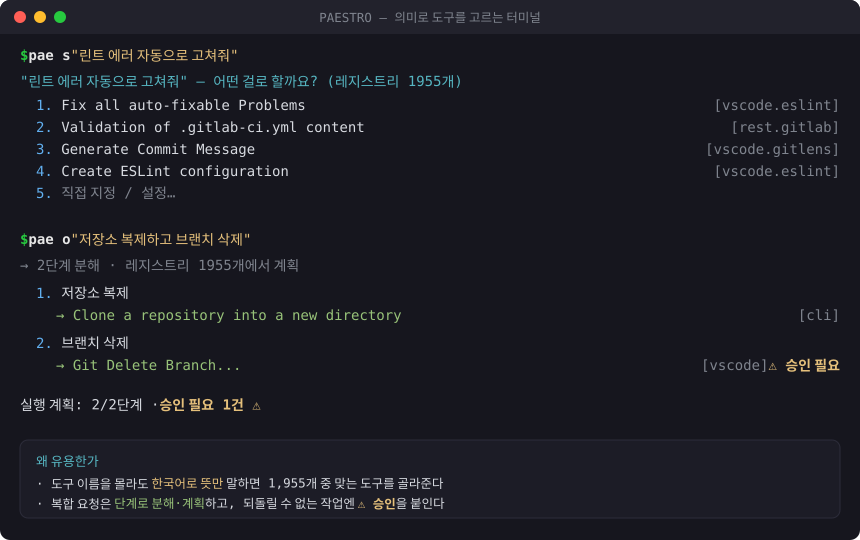
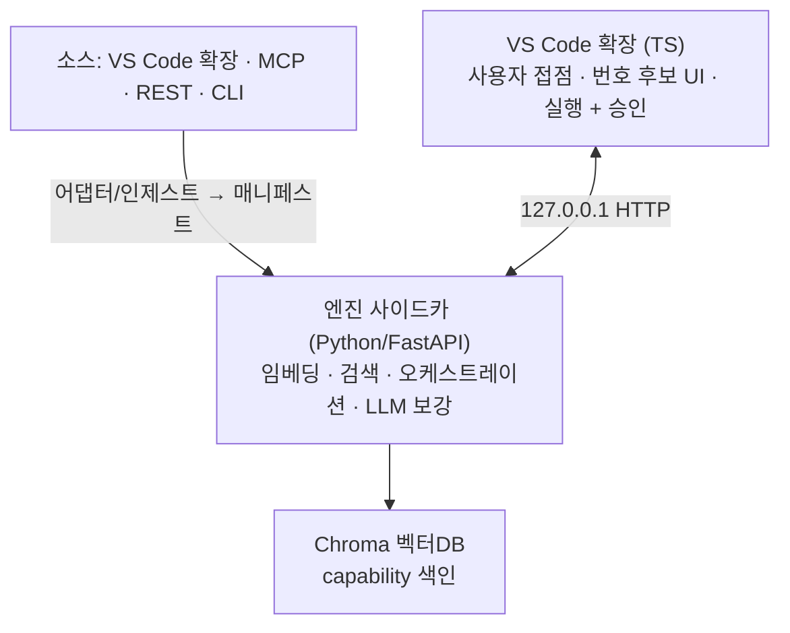

# PAESTRO

**의미로 고르는 플러그인 라우터 + 오케스트레이터.** 개발자가 자연어로 시키면, PAESTRO가 벡터DB에서 관련 도구(VS Code 확장 명령 · MCP · REST · CLI)를 찾아 **번호가 붙은 후보 목록**으로 띄운다. 사용자가 고르면 실행하고, 되돌릴 수 없는 작업(`irreversible`)은 실행 직전 승인을 받는다. 접점은 **VS Code 확장**, 무거운 로직은 **Python 엔진 사이드카**가 맡는다.



> 위는 실제 CLI 출력이다. `pae s "..."` 로 뜻만 말하면 후보를 골라주고, `pae o "..."` 로 복합 요청을 단계로 분해·계획하며 되돌릴 수 없는 작업엔 ⚠ 승인을 붙인다.

```bash
pae s "린트 에러 자동으로 고쳐줘"      # 뜻으로 도구 검색 → 번호 후보 (엔진·설치 불필요, 오프라인)
pae o "저장소 복제하고 브랜치 삭제"    # 복합 요청 → 단계 계획 (⚠ 승인 표시)
```

---

## 목차

1. [왜 필요한가](#왜-필요한가)
2. [어떻게 동작하는가](#어떻게-동작하는가) — 요청 생애주기
3. [지금 상태 (실측)](#지금-상태-실측)
4. [현재 범위 — 되는 것 / 아직 안 되는 것](#현재-범위--되는-것--아직-안-되는-것)
5. [사용법](#사용법) — CLI · 엔진 · 확장 · 환경변수
6. [검색 방식 (하이브리드)](#검색-방식-하이브리드)
7. [오케스트레이션](#오케스트레이션)
8. [안전 원칙](#안전-원칙)
9. [평가 · 정합성](#평가--정합성)
10. [레지스트리 (오픈소스 크롤)](#레지스트리-오픈소스-크롤)
11. [아키텍처 · 저장소 구조](#아키텍처--저장소-구조)
12. [개발 원칙 · CI](#개발-원칙--ci)
13. [관련 연구 · OSS](#관련-연구--oss)

---

## 왜 필요한가

도구가 많아질수록 LLM은 오히려 못 고른다 — 50~100개만 넘어도 성능이 급락하고, 에이전트당 도구 상한은 128개다. 전부 프롬프트에 넣는 방식(prompt bloat)은 한계에 부딪힌다.

**해법:** 도구를 프롬프트에 다 넣지 말고 **벡터DB에 색인해두고 필요한 것만 의미 검색으로 꺼낸다.** (근거: RAG-MCP — 프롬프트 토큰 50%↓, 도구 선택 정확도 3배↑.) PAESTRO는 이 검색을 개발자가 이미 쓰는 **VS Code 안에서**, 그리고 **한국어로** 제공한다.

## 어떻게 동작하는가

한 번의 요청이 처리되는 흐름:

```
요청("저장소 복제하고 브랜치 삭제")
      │
      ▼  [4] 분해   복합 요청을 단계로 쪼갬 (한국어 연결어미 '-고' 등, 키 있으면 LLM planner)
   ["저장소 복제", "브랜치 삭제"]
      │
      ▼  [3] 검색   각 단계를 벡터DB에서 의미검색 → 후보 top-k (하이브리드 리콜)
   1: Clone a repository [cli] · 2: Git Delete Branch [vscode]
      │
      ▼  [5] 게이트  side_effects 판정 → irreversible엔 승인 플래그
   삭제 = irreversible → ⚠ 승인 필요
      │
      ▼  [1] 실행   사용자가 후보/계획 확인 → VS Code 명령 실행 (승인 대상은 모달 확인)
```

단계 번호는 저장소 구조의 계층( [1] 인터페이스 · [3] 지식 · [4] 오케스트레이터 · [5] 안전 )과 대응한다.

## 지금 상태 (실측)

- 🟢 **오픈소스 크롤 레지스트리 1,955 capability · 47 소스 · 4 런타임** — VS Code 확장 · MCP 서버(공식 레지스트리) · REST API(apis.guru: Stripe·Slack·GitHub 등) · CLI(git·docker·gh·kubectl)를 실제 크롤(`registry/crawl.py`). 승인 대상(irreversible) 138개 자동 분류.
- 🟢 **END-TO-END 검증**: 크롤 → 정규화 → 엔진(mpnet+Chroma) 색인 → 의미 검색. 실측(레지스트리 정렬 26문항) top-3 **전체 80.8% · KO 76.9% · EN 84.6%**, MRR 0.699 (`eval/run_eval.py`).
- 🟢 **하이브리드 검색**: mpnet-base-v2 dense + lexical 리콜(구절·AND·토큰 `$contains`) + 연속구절 보너스로, 소형 다국어 모델이 음차/한글을 놓치는 약점을 보완. 고가치 34개 한국어 실측 top-3 **엔진 100%**(`eval/engine_overlay_eval.py`).
- 🟢 **멀티스텝 오케스트레이션**: 복합 요구 → 단계 분해(규칙기반, 키 있으면 LLM planner) → 크로스-런타임 계획 → 단계별 승인 (엔진 `/orchestrate` + 확장 `paestro.orchestrate`).
- 🟢 **안전 게이트 실재화**: 파괴적 명령(삭제·배포·force)은 `irreversible`로 분류되어 실행 직전 승인.
- 🟢 **검색 결정성**: 동일 질의 반복 시 결과 불변 — 누적 ~600회(15,600+ 검색) 서명 동일(`eval/consistency.py`).

## 현재 범위 — 되는 것 / 아직 안 되는 것

과장 없이, 사실 기준.

| | 상태 |
|---|---|
| 4런타임(vscode·mcp·rest·cli) **검색·후보·계획** | ✅ 됨 |
| 한국어/영어 의미 검색, 복합 요청 단계 분해 | ✅ 됨 |
| `side_effects` 승인 게이트 | ✅ 됨 |
| **VS Code 명령 실행** (`executeCommand`, `invocation.args` 인자 전달) | ✅ 됨 |
| **CLI 실행** | ✅ 됨 — 통합 터미널에 명령 준비(플레이스홀더 `{n}`는 입력 프롬프트), 검토 후 Enter |
| 오프라인 CLI(`pae`), 엔진 검색/오케스트레이션 | ✅ 됨 |
| **REST 실행** | ✅ 허용목록 한정 — `paestro.rest.allowlist` 호스트만, **매 호출 승인 + 인증값 비저장**. 목록 밖은 표시+복사만(무단 호출 금지) |
| **MCP 실행** | ⏳ 미지원 — MCP 클라이언트 연결 필요(현재는 서버/도구 안내) |
| **LLM 보강 · LLM planner** | 🔑 선택 — `ANTHROPIC_API_KEY` 있을 때 활성. 없으면 규칙기반 폴백으로 동작 |
| 플랫폼 | Windows 검증 위주(경로만 주의하면 mac/linux 동작 설계) |

## 사용법

### 1) 오프라인 CLI — 가장 쉬움 (설치·엔진 불필요, stdlib만)

`pae` 런처(`pae.cmd`/`pae`)로 `python pae.py` 없이 바로 쓴다. 전역에서 쓰려면 PowerShell 프로필에 `function pae { python <경로>\pae.py @args }` 한 줄.

```bash
pae s  "결제 환불"                     # 검색 → 번호 후보 (Stripe refund 등)
pae o  "환불하고 이슈 생성"            # 복합 → 단계 계획
pae st                                  # 레지스트리 통계(런타임·안전등급·플러그인)
pae d                                   # 환경 진단(의존성·엔진·키)
pae c                                   # 로컬 CI 5종
```

**명령 · 별칭**

| 별칭 | 정식 | 하는 일 |
|---|---|---|
| `s` | `search` | 자연어 → 번호 후보 |
| `o` | `orchestrate` | 복합 요청 → 단계 계획 |
| `st` | `stats` | 레지스트리 분포 |
| `i` | `index` | 엔진 색인(`--post URL`) |
| `e` | `eval` | 검색 정확도 측정(엔진 필요) |
| `v` | `validate` | 매니페스트 계약 검증 |
| `c` | `check` | 로컬 CI(safety·validate·pipeline·regression·overlay) |
| `d` | `doctor` | 환경 진단 |
| — | `crawl` | 오픈소스 크롤 → `registry/catalog.json` |

### 2) 엔진 — 의미 검색(권장, mpnet 임베딩 ~1GB)

```bash
cd engine && python -m venv .venv && .venv/Scripts/activate   # (mac/linux: source .venv/bin/activate)
pip install -r requirements.txt
uvicorn app:app --host 127.0.0.1 --port 8756                   # 첫 실행 시 모델 다운로드
python ../registry/to_index.py --post http://127.0.0.1:8756   # 카탈로그를 엔진에 색인
```
> ⚠ 엔진은 반드시 `engine/`에서 실행한다(상대경로 `.chroma`). 메모리가 빠듯한 PC에선 엔진과 무거운 테스트를 동시에 돌리지 말 것.

### 3) VS Code 확장 — 제품 인터페이스

```bash
cd extension && npm install && npm run build
# VS Code에서 extension 폴더 열고 F5 → 명령 팔레트(Ctrl+Shift+P)
#   → "PAESTRO: 재색인" → "PAESTRO: 자연어로 도구 실행" → 문장 입력 → 번호 후보 선택
```
(검색은 ②엔진이 떠 있어야 동작한다.)

**확장 설정** — `paestro.rest.allowlist`: 실제 호출을 허용할 REST 호스트 목록(예: `["api.github.com"]`). 비어 있으면 REST는 표시/복사만. 목록에 있어도 매 호출 승인을 받고 인증값은 저장하지 않는다.

### 환경변수 (선택)

| 변수 | 필수? | 효과 |
|---|---|---|
| `ANTHROPIC_API_KEY` | 선택 | LLM 보강(전체 capability에 `when_to_use`·한국어 키워드 생성) + 오케스트레이터 LLM planner 활성. 없으면 규칙기반 폴백 |
| `PAESTRO_PLANNER_MODEL` | 선택 | planner 모델 지정(기본 `claude-sonnet-5`) |
| `HF_TOKEN` | 선택 | HuggingFace 모델 다운로드 속도 제한 완화 |

> 🔒 키는 채팅/명령에 붙여넣지 말고 **환경변수로만** 설정한다. `pae d`가 키 감지 여부를 확인한다.

## 검색 방식 (하이브리드)

소형 다국어 임베딩(mpnet-base-v2)은 한국어·음차(예: "체리픽")를 자주 놓친다. PAESTRO는 dense 검색에 **lexical 리콜 채널**을 합쳐 이를 구제한다:

1. **dense 리콜** — 임베딩 근접 top-N.
2. **구절 `$contains` 리콜** — 질의 전체를 연속 부분문자열로 포함하는 문서를 직접 회수(정답이 dense로 크게 밀려도 후보 풀에 진입).
3. **AND `$contains` 리콜** — 모든 질의 토큰을 동시에 포함하는 문서(완전 렉시컬 매치).
4. **토큰 리콜** — 토큰별 부분 매치.
5. **재랭크** — `dense + 0.4·lexical + 0.5·연속구절보너스`로 합집합을 정렬.

연속구절 보너스는 형제 명령이 흩어진 토큰으로 동점일 때 "질의를 통째로 담은" 정답을 변별한다. 한국어는 `enrich/ko_terms.json`(영→한 동의어)과 `enrich/overlay.json`(고가치 capability 수동 보강)로 보강한다.

## 오케스트레이션

복합 요구를 단계로 분해 → 각 단계 검색 → 안전 게이트.

- **분해**: 한국어 연결어미(`-고`·`그리고`·`그다음`)와 영어(`then`/`and`)·콤마로 분리. `-고` 앞의 경동사 어간(`하`/`해`)을 함께 소비해 "자동수정하고"→"자동수정"으로 어간 뭉갬을 방지. `ANTHROPIC_API_KEY`가 있으면 Claude planner가 규칙기반을 대체.
- **계획**: 각 단계를 검색해 top 후보를 고르고 대안을 함께 제시.
- **게이트**: `irreversible` 단계엔 `needs_approval` 플래그 → 확장이 실행 직전 모달 확인.

엔진 `POST /orchestrate {query, k}` → `{multi_step, steps:[{n, step, chosen, alternatives}], needs_approval}`.

## 안전 원칙

`side_effects` 등급으로 실행을 통제한다:

| 등급 | 의미 | 동작 |
|---|---|---|
| `read_only` | 조회·이동·표시 | 자동 실행 |
| `reversible` | 되돌릴 수 있는 변경 | 실행 |
| `irreversible` | 삭제·배포·force 등 | **실행 직전 사용자 승인** |

분류는 `enrich/safety.py`가 규칙 기반으로 수행하며 15개 회귀 테스트(`enrich/test_safety.py`)로 잠근다.

## 평가 · 정합성

| 하네스 | 엔진 | 재는 것 |
|---|---|---|
| `eval/run_eval.py` | 필요 | top-1/top-3/MRR (기본 `queryset.registry.json`). 실측 top-3 80.8% |
| `eval/engine_overlay_eval.py` | 필요 | 고가치 34개 한국어 정밀도. 실측 top-3 100% |
| `eval/consistency.py` | 필요 | 같은 질의 N회 반복 → 결과 결정성(서명 1종=완전 결정적) |
| `eval/overlay_regression.py` | 불필요 | overlay KO 매핑 오프라인 회귀(`pae c`에 포함) |

```bash
pae e                                  # 기본 정확도(엔진 필요)
python eval/consistency.py --runs 100  # 정합성 100회 — 비결정적이면 exit 1
```

## 레지스트리 (오픈소스 크롤)

```bash
python pae.py crawl              # 오픈소스 크롤 → registry/catalog.json (1,955 capability · 4 런타임)
python pae.py stats              # 런타임·안전등급·플러그인 분포
```

`registry/sources.json`에 repo·MCP 레지스트리 URL·apis.guru provider·스펙 URL만 추가하면 크롤이 확장된다. VS Code 확장·MCP·REST·CLI를 각 `ingest/` 변환기로 매니페스트로 정규화한다. 전체 `catalog.json`은 생성물이라 gitignore이며, 요약 스냅샷은 `registry/STATS.md`에 둔다.

## 아키텍처 · 저장소 구조



- **인터페이스 (`extension/`, TypeScript)** — 마켓플레이스 배포 단위. 설치된 확장 command 수집 + 엔진 검색 결과를 번호 후보로 표시, `executeCommand`로 실행.
- **엔진 (`engine/`, Python)** — 임베딩·Chroma·오케스트레이션·LLM 보강 등 무거운 로직. `127.0.0.1:8756` HTTP.
- **계약 (`schemas/`)** — 모든 소스는 하나의 **Capability 매니페스트**로 정규화. 검색 단위는 플러그인이 아니라 개별 **capability**. 검색용 메타(`intent`·`keywords`·`when_to_use`)와 실행용 메타(`invocation`)를 한 문서에 담는다.

```
extension/     [1] 인터페이스 — VS Code 확장 (TS): extension.ts, engineClient.ts
engine/        엔진 사이드카 (Python/FastAPI) + paestro/ 패키지
  paestro/index/         [3] 지식 — 임베딩·Chroma·하이브리드 검색(store.py)
  paestro/orchestrator/  [4] 오케스트레이터 — 분해→검색→게이트(pipeline.py)
  paestro/harness/       [5] 안전 — side_effects 승인 게이트(gate.py)
  paestro/adapters/      [2] 어댑터 — 소스 정규화·보강
schemas/       [계약] capability-manifest.schema.json + validate.py
examples/      [계약] 4런타임 정본 매니페스트 (vscode·mcp·rest·cli)
ingest/        오프라인 인제스트 — OpenAPI·MCP·CLI·VS Code pkg → 매니페스트
enrich/        LLM 보강 + safety(side_effects) + ko_terms/overlay(한국어 보강)
eval/          평가 — run_eval·engine_overlay_eval·consistency·overlay_regression
registry/      [6] 거버넌스 — crawl·search·orchestrate·stats·to_index
docs/          demo.svg · oss-landscape.html · ARCHITECTURE.md · design-tokens.css
pae.py         통합 CLI(+ pae 런처) — crawl·search·orchestrate·stats·index·validate·eval·demo·check·doctor
```

## 개발 원칙 · CI

- 검색 단위 = **capability**(플러그인 아님). 새 소스는 어댑터/인제스트로 매니페스트만 만들면 편입된다.
- 매 변경은 `pae c`(= `pae.py check`: safety·validate·pipeline·regression·overlay) 가 **CI(GitHub Actions)** 로 자동 검증 — 계약·검색 품질이 깨지면 즉시 실패.
- 언어 경계: 사용자 접점은 TS, 무거운 로직은 Python. 둘은 로컬 HTTP로만 통신.
- 오프라인 툴체인(crawl·search·orchestrate·eval 회귀)은 **의존성 0**(stdlib). 엔진/시맨틱만 fastembed·chromadb 필요.

## 관련 연구 · OSS

이론적 근거는 **RAG-MCP**(도구 검색 주입) · **MCP-Zero**(능동적 도구 검색). 유사 오픈소스 지형(시맨틱 라우터 **OmniMCP**, 검색전략 **ScaleMCP**/**ToolShed**, 게이트웨이 **ContextForge**/**MCPJungle**)과 PAESTRO의 차별점(4런타임·에디터 인터페이스·한국어 검색·승인 게이트) 비교는 [`docs/oss-landscape.html`](docs/oss-landscape.html) 참조.
